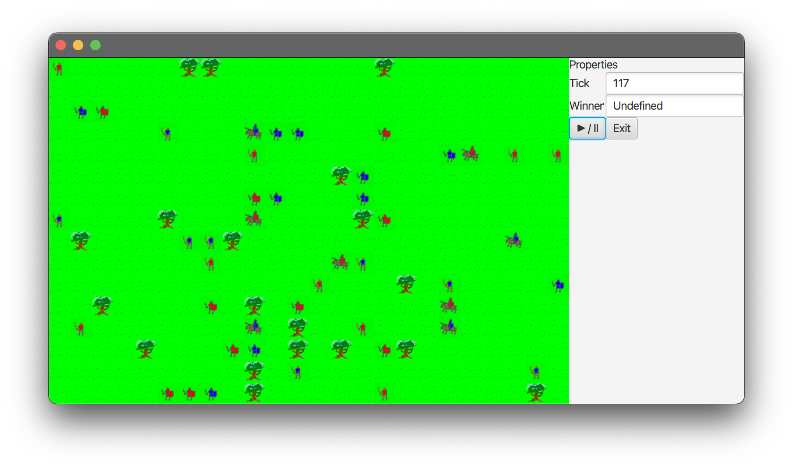

= Agenta: a simple agent-oriented AI "game"

I've originally created this project somewhere around 2006-2008 and abandoned for years since then.
Now I play with old & new code trying to make something interesting (for me).

Like in some real-time strategy, we have two teams of "units" that fight each other.
Every unit is driven by a simple AI, and together they should behave like a real army - or at least like a mob.

.A gameplay view

I try to introduce new behaviors and looking after their impact.
That's the essence of my "game".
