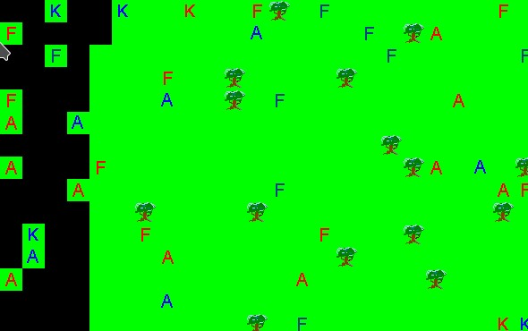

= I see dead people

I've had a hard time beating Clojure over-laziness and trying to improve drawing performance.
One of key improvements was caching of game map.
An idea is simple: since ground is static, we could draw it only once at the game start, and only put units on it each tick.

Quite trivial trick, but it happened not to play well with Spring, multi-threading and my old image loading routines.
The code looked fine, but the game map did not.

After some of experimenting I've started to understand that I should not use same Swing objects in my Clojure code that may go under synchronisation primitives (such as `atom`).
Unfortunately, in my old code, I've use an instance of `ImagePanel` to draw initial game map image and to draw it copies on each tick.

[source, clojure]
----
(defn draw-image [^Graphics graphics
                  ^ImagePanel p             ;; this panel was needed to load toolkit
                  image-cache
                  tile-name
                  x
                  y]
  (.drawImage graphics
              (image-cache tile-name
                           ;; a toolkit did the actual work of image loading
                           (.getImage (.getToolkit p)
                                      (str "Pictures/" tile-name ".gif")))
              (int (* 25 x))
              (int (* 25 y))
              p))
----

Is it possible to prepare an image without attaching it to an `ImagePanel`?
An Internet to help!

After quick googling I've found an easy modern way to load images.
Now my method looks simpler and, importantly, is thread-safe.

[source, clojure]
----
(defn draw-image [^Graphics graphics
                  observer
                  image-cache
                  tile-name
                  x
                  y]
  (.drawImage graphics
              (image-cache tile-name
                           ;; use ImageIO/read, Luke!
                           (ImageIO/read (File. (str "Pictures/" tile-name ".gif"))))
              (int (* 25 x))
              (int (* 25 y))
              observer))
----

Now, all drawing artifacts are gone... or not?

It looks strange that units do not pass away as they get killed.
What the heck?
Code still looks fine: we take game map image, make its _copy_ on each tick, and then put unit images.
An old background cannot be corrupted.

But units, let's take a look on them!
The solution was quite easy:

[source,diff]
----
diff --git a/src/agenta/engine.clj b/src/agenta/engine.clj
index 37dd1da..d6cb971 100644
--- a/src/agenta/engine.clj
+++ b/src/agenta/engine.clj
@@ -57,7 +57,7 @@
     (loop [units u winner -1 steps 0]
       (let [alive-units (filter #(.isAlive %) units)
             units-per-player (group-by #(.getPlayer %) alive-units)]
-        (viewer m u)
+        (viewer m alive-units)
         (if (or (<= 0 winner) (<= limit steps))
           {:winner winner :steps steps}
           (let [all-actions (map #(-run-unit-action % m) alive-units)
----

I've added passing of unit list into `viewer` as quick trick in the middle of active refactoring.
Drawing of dead units was here from the beginning - but I haven't notice it because drawing issues seemed more important to be fixed.
And when I've finished with drawing artifacts, this piece of code was already almost forgotten and marked as "fine" in my mental model of it.

But it was not fine.

A simple but funny error, and a good lesson for me.
