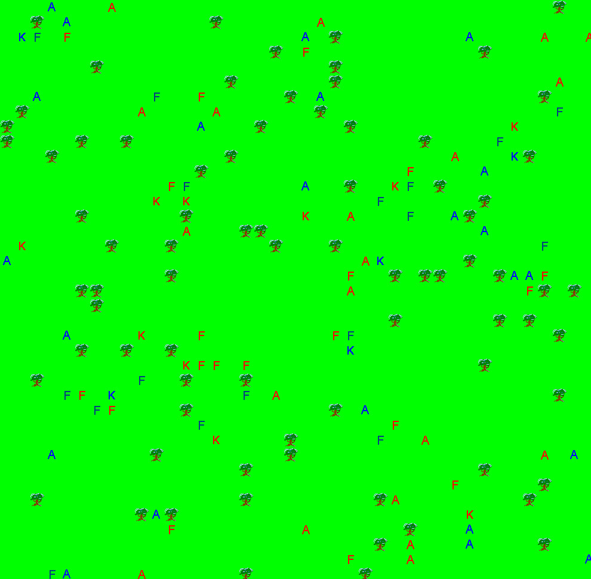

= Game map of arbitrary size

At last, it happens: now game map doesn't always have to be a 18x18 square.
That's another limitation of old engine I've eliminated.

Now the size, and the shape of game map can be set in setting file.
Of course, first of all I've tried to start a colossal battle.
What happens next?
Of course, it becomes obvious that the naive rendering attempt in `PanelViewer` ("rebuild full map on each step") is way too non-optimal.
I think, it should be fixed someday after the rewrite in Clojure.

.I need only few changes in demo.edn to achieve this!

There's also a lot of TODOs in this picture:

* Glyphs definitely need nicer look!

* Unit placement is totally random - that's not fine.
I want to make a battle of armies, so they need to have some kind of structure at start.

* Units must coordinate their actions.
I've removed the most of an old "AI" level at the start of project's refreshing, but such a situation is not satisfying.

Nevertheless, this weekend is over, so all the work has been paused for a while.
Maybe I'll find a time to add few old diaries retrospectively, but expect no changes in code.
