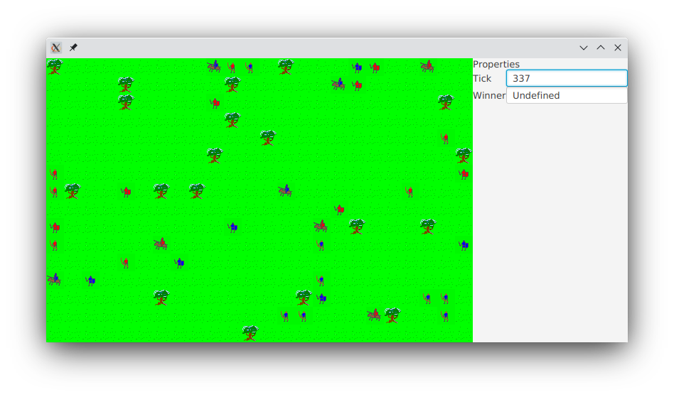

= Bye, Swing!

An old demo UI has been removed.
It was based on Swing and AWT, two legacy libraries.

A new one was implemented.
It's based on JavaFX library and shiny https://github.com/cljfx/cljfx[CljFX] wrapper.

There are some plans related to the new UI.
I'd like to implement detailed game view and contols.

It should be possible to load and replay different scenarios, contol simulation flow: pause, restart, step forward, adjust playing speed, view unit stats, and so on.
Quite a lot of work, but with `cljfx` it seems not as hard as with Swing.
